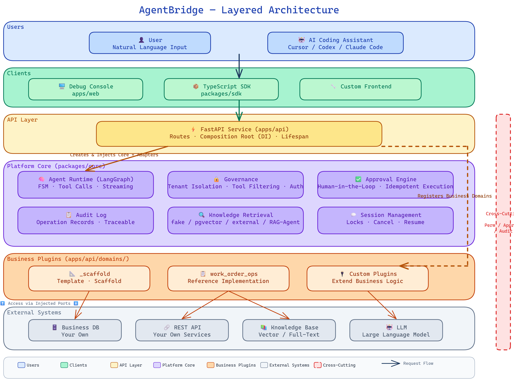

<div align="center">

# AgentBridge

🔌 **Add Agent capabilities to your business systems — knowledge retrieval, data analysis, structured output, human-in-the-loop approval — without changing a single line of existing code.**

Built for [Vibe Coding](#-vibe-coding-integration): let AI coding assistants write your plugins.

[简体中文](README.zh-CN.md) · [Documentation](docs/INDEX.md) · [Architecture rules](AGENTS.md) · [Vibe Coding Guide](SKILL.md)

[](https://github.com/Foamtor/AgentBridge/actions/workflows/ci.yml)
[](LICENSE)
[](packages/core/pyproject.toml)

</div>

---

> Whether your system is a government service platform, enterprise ERP, device management tool, or internal ops dashboard — if it has APIs or a database, AgentBridge can add an Agent layer alongside it. Users describe what they need in natural language. The Agent pulls from your business data and dynamically generates tables, charts, and reports. Write operations go through human approval.
>
> **No changes to existing systems. No data migration. No cloud dependency.** Runs on your own machines, MIT licensed.

<!-- TODO: Record GIF demo → docker compose up → browser → describe a need → dynamic result appears -->
<!--
<p align="center">
  
</p>
-->

## 🏗️ How it works without changing your code

AgentBridge doesn't touch your business systems. It adds an adapter layer next to your existing APIs — you write a plugin that describes what your APIs can do, and AgentBridge handles everything else.

<p align="center">
  
</p>

You write the plugin, the platform handles the rest:

| ✏️ You write | 🔧 The platform handles |
|-------------|----------------------|
| What your APIs can do, what parameters they need, what format they return | Conversation management, streaming output, session state |
| How to query and analyze business data | Permission checks, tenant isolation, tool filtering |
| Where the knowledge base lives, what structured results look like | Human approval, operation audit, cancel and resume |

## 🔩 Under the hood

AgentBridge is a source-first Python platform with explicit boundaries between reusable runtime code, host wiring, and business plugins.

| Layer | Implementation | Responsibility |
|-------|----------------|----------------|
| Client | React + Vite debug console, TypeScript SDK, or your own frontend | Sends chat requests and renders text, tables, charts, citations, drafts, and approval states |
| API host | FastAPI in `apps/api`; Nginx provides the same-origin `/api` proxy in Compose | HTTP routes, authentication middleware, request context, health endpoints, and dependency wiring |
| Runtime core | Python package in `packages/core`; LangGraph runtime behind platform interfaces | Run lifecycle, ordered streaming, per-thread coordination, cancellation, checkpoints, tool execution, and event logging |
| Governance | Policy engine, tool guard, approval store/action registry, audit hooks | Filters tools before the model sees them, authorizes again at invocation, and gates writes behind human approval |
| Business plugins | `apps/api/domains/<name>` registered by the API composition root | Business tools, state, workflow graph, permissions, and structured extension events |
| Integration ports | DataSource, Retriever, LLM Gateway, stores, locks, and checkpointers | Keeps database, knowledge, model, and infrastructure implementations replaceable |

The request path is:

```text
Client → FastAPI route → RunLifecycle → registered business graph/tools
       ← Nginx / SSE ← recorded outbound events and structured extensions
```

`apps/api/lifespan.py` is the production composition root: it creates adapters, registers plugins, and injects implementations into the runtime. `packages/core` never imports a concrete business plugin, and plugins do not create infrastructure adapters or emit SSE directly. See [the architecture summary](docs/architecture.md), [event contracts](docs/contracts.md), and [non-negotiable rules](AGENTS.md).

The default Compose stack starts the React console, FastAPI service, and PostgreSQL with pgvector. Redis and Authentik are optional profiles. The technical preview deliberately uses an offline model stub and fake knowledge backend, while Postgres-backed business data and approval execution exercise the complete demo flow. Fake remains available for deterministic demos. For an environment default, set `LLM_MODE=openai_compatible` with an OpenAI-compatible endpoint, model, and key. The repository `.env` is persistently mounted into the API, so an administrator can re-authenticate in the console's Models page to generate and save `MODEL_CONFIG_ENCRYPTION_KEY` during both direct development and Compose use. Model API keys are encrypted at rest and never returned to the browser.

## 🤖 Vibe Coding Integration

AgentBridge is built for Vibe Coding. You don't need to write code yourself — let Cursor, Codex, Claude Code, or other AI assistants write the plugin for you.

**Three steps:**

1. Clone the repo, open it in your AI coding assistant
2. Point the assistant to [`SKILL.md`](SKILL.md)
3. Describe your business system — the assistant writes the plugin

```
Read SKILL.md, then help me integrate my business system.

My system: <one sentence about what it does>
My APIs: <list your endpoints or database tables>
What users will ask: <a few real examples>
```

Detailed guide and copy-ready prompts in [`SKILL.md`](SKILL.md).

## 🎯 When to use it

You already have APIs or databases and want to add Agent capabilities — whether it's a prototype for stakeholders or a real tool for your team.

- 🔍 **Product validation**: Quickly show "our system can do AI-powered data analysis"
- ⚡ **Internal efficiency**: Add a natural language entry point to existing systems
- 🔗 **Shared governance**: Multiple systems sharing one set of permissions, approvals, and audit

## ⚠️ When NOT to use it

- 🚫 Building an AI product from scratch (no existing APIs) → Use LangGraph, CrewAI, or similar
- 🚫 High-frequency real-time trading (Agent adds 1–3s latency) → Use a traditional API gateway
- 🚫 Replacing your entire auth system → AgentBridge integrates with your login, but doesn't replace it
- 🚫 Multi-node scaling out of the box → Requires explicit configuration

Simple test: your system has APIs, you want AI to call them with permission and approval controls — use AgentBridge. You're building an AI product from scratch — you don't need it.

## 🚀 Run it and see for yourself

```bash
git clone https://github.com/Foamtor/AgentBridge.git
cd AgentBridge
docker compose up --build
```

The Compose demo defaults to the DaoCloud registry mirror for China. To use official Docker Hub paths instead, set `IMAGE_REGISTRY=docker.io` in `.env`.

Open `http://localhost:8080`. On the first start, retrieve the one-time administrator password from the API log:

```bash
docker compose logs api
```

Sign in as `admin`, set a strong new password, then use the Verification Workbench to run `work_order_ops`.

For daily plugin work, open `/playground`: it keeps request composition, thread history, live SSE, timing, tool traces, contract checks, JSONL export, and badcase annotations together. See [Plugin Playground](docs/plugin-playground.md) for Fake versus real-model reference-case setup.
If you set `WEB_PORT`, use that port instead.

> 💡 No API key or cloud service needed. The Compose demo includes PostgreSQL, an offline model, and synthetic demo data. The initial password is never committed or fixed in the image.
>
> Details in the [quick-start guide](docs/guide/02-quickstart.md).

## 📋 A complete example

The repo includes a reference implementation called `work_order_ops` that walks through a full business loop.

| 👤 User | 🤖 System |
|---------|----------|
| "Show me this month's tickets" | Queries the business database, dynamically generates tables and charts |
| "Search the handling guidelines" | Retrieves from the knowledge base, cites sources |
| "Create a work order for me" | Generates a draft based on the conversation, waits for confirmation |
| — | Shows an approval prompt, waits for decision |
| "Approve" | Executes the creation — idempotent, won't duplicate records |

All demo data is synthetic. It's not a finished product — it's a template for building your own plugin.

## 📦 What the platform does

| Capability | What it actually does |
|-----------|----------------------|
| 🤖 Agent runtime | Understands user intent, decides which APIs to call, organizes results |
| 📚 Knowledge retrieval | Connects your knowledge base, cites sources when answering |
| 🔒 Permission control | Different users see different data, checked before every API call |
| ✅ Human approval | Write operations require confirmation, execution is idempotent |
| 📋 Operation audit | Every invocation logged, fully traceable |
| 📊 Structured output | Dynamically generates tables, charts, ledgers, approval forms |
| 🧩 Plugin isolation | Your code and the platform code stay out of each other's way |

## 🗂️ Repository structure

```
packages/core/          Platform core: lifecycle, protocols, adapters
apps/api/               Service entry: routes, composition
│   └── domains/        Your business plugins go here
│       ├── _scaffold/  Plugin template
│       └── work_order_ops/  Reference implementation
apps/web/               Debug console
packages/sdk/           TypeScript client
docs/                   Documentation
SKILL.md                Vibe Coding integration guide (for AI assistants)
```

## 📊 Current status

- 🚧 v0.1.0 Technical Preview preparation
- 🚧 Real Docker Compose golden smoke still needs an environment with Docker Engine and registry access
- ✅ Reference `work_order_ops` implementation included
- ⚠️ CI cleanup is in progress
- 🚧 Production deployment drills, migration/recovery, concrete IdP integration, multi-instance validation, and package publishing are post-1.0 follow-up work

## 🤝 Contributing

1. Fork → Branch → PR
2. Read [CONTRIBUTING.md](CONTRIBUTING.md) for code standards
3. Use only redacted example data — never commit real business data

## 📄 License

MIT © [Foamtor](https://github.com/Foamtor)

---

<div align="center">

**Find it useful? Give us a ⭐ Star!**

</div>
