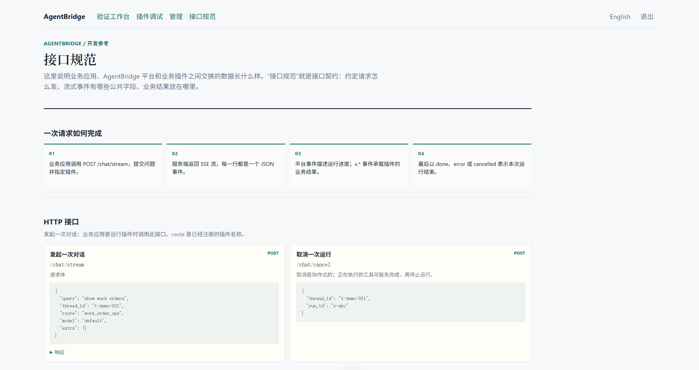
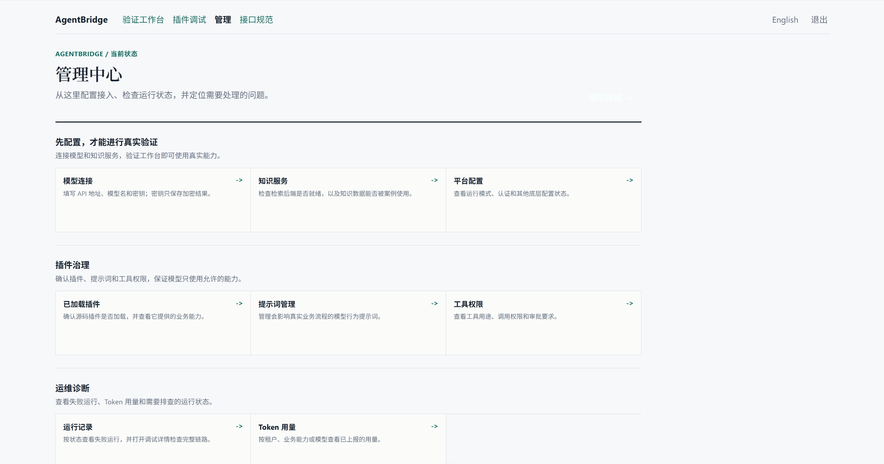
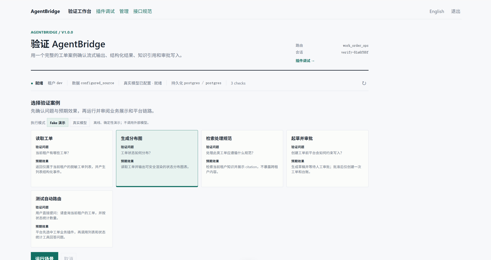
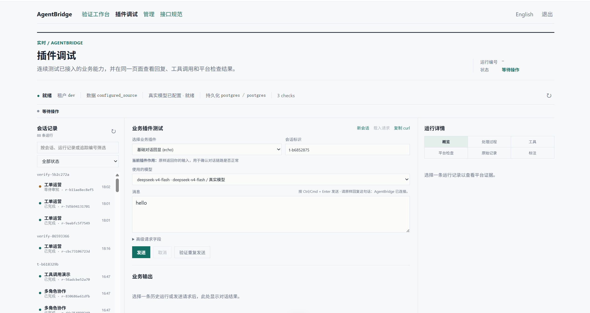

<div align="center">

# AgentBridge

🔌 **给你的业务系统加上 Agent 能力——知识检索、数据分析、结构化输出、人工审批——不改一行现有代码。**

面向 [Vibe Coding](#-用-vibe-coding-方式接入你的业务系统)：让 AI 编程助手帮你写插件，几分钟接好。

[English](README.md) · [文档](docs/INDEX.md) · [架构规则](AGENTS.md) · [Vibe Coding 接入指南](SKILL.md)

[](https://github.com/Foamtor/AgentBridge/actions/workflows/ci.yml)
[](LICENSE)
[](packages/core/pyproject.toml)

</div>

---

> 不管你的业务系统是政务平台、企业 ERP、设备管理还是内部运营工具，只要它有 API 或数据库，AgentBridge 就能在它旁边加一层 Agent 能力：用户用自然语言描述需求，Agent 根据业务数据动态生成表格、图表、分析报告，需要写操作时走人工审批。
>
> **不动现有系统，不迁移数据，不依赖云服务。** 装在你自己的机器上，MIT 开源。

## 🏗️ 怎么做到不改现有代码

AgentBridge 不碰你的业务系统。它在你现有接口旁边加一层适配——你写一个插件描述你的 API 能做什么，AgentBridge 负责让 Agent 能调用它，并管好权限、审批、审计这些公共的事。

<p align="center">
  
</p>

你写插件，平台管剩下的事：

| ✏️ 你写的 | 🔧 平台管的 |
|-----------|------------|
| 你的 API 有哪些能力、要什么参数、返回什么格式 | 对话管理、流式输出、会话状态 |
| 业务数据怎么查、怎么分析 | 权限校验、租户隔离、工具过滤 |
| 知识库挂哪里、结构化结果长什么样 | 人工审批、操作审计、取消和恢复 |

## 🔩 底层架构

AgentBridge 是一个源码优先的 Python 平台，刻意把可复用运行时、宿主组装和业务插件分开。

| 层次 | 实现 | 职责 |
|------|------|------|
| 客户端 | React + Vite 调试台、TypeScript SDK，或你的业务前端 | 发起对话请求，渲染文字、表格、图表、引用、草稿和审批状态 |
| API 宿主 | `apps/api` 中的 FastAPI；Compose 中由 Nginx 提供同源 `/api` 代理 | HTTP 路由、认证中间件、请求上下文、健康检查和依赖组装 |
| 平台运行时 | `packages/core` Python 包；通过平台接口使用 LangGraph 运行时 | 运行生命周期、有序流式输出、同会话协调、取消、检查点、工具执行和事件记录 |
| 治理层 | 权限策略、工具守卫、审批存储/执行注册表、审计钩子 | 模型看见工具前先过滤，调用时再次鉴权，写操作必须经过人工审批 |
| 业务插件 | 由 API 组装根注册的 `apps/api/domains/<名字>` | 业务工具、状态、流程图、权限声明和结构化扩展事件 |
| 集成接口 | DataSource、Retriever、LLM Gateway、存储、锁和检查点接口 | 让数据库、知识库、模型和基础设施实现可以替换 |

一次请求的主链路是：

```text
客户端 → FastAPI 路由 → RunLifecycle → 已注册的业务流程和工具
       ← Nginx / SSE ← 已记录的出站事件和结构化扩展结果
```

<p align="center">
  
</p>

`apps/api/lifespan.py` 是生产组装根：负责创建适配器、注册插件，并把实现注入运行时。`packages/core` 不导入任何具体业务插件；业务插件也不自行创建基础设施适配器或直接发送 SSE。详细说明见[架构摘要](docs/architecture.md)、[事件契约](docs/contracts.md)和[不可违反的规则](AGENTS.md)。

默认 Compose 会启动 React 调试台、FastAPI 服务和带 pgvector 的 PostgreSQL；Redis 与 Authentik 是可选 profile。v1.0.0 单机稳定版保留离线模型桩和 fake 知识后端用于确定性验证，同时以 PostgreSQL 业务数据和审批执行跑通完整演示闭环；真实 OpenAI 兼容模型和外部 RAG 可按需接入。可通过 `LLM_MODE=openai_compatible`、兼容 OpenAI 的模型地址、模型名和密钥配置环境默认模型；根目录 `.env` 会持久挂载给 API，管理员可在控制台“模型”页二次验证密码后生成并保存 `MODEL_CONFIG_ENCRYPTION_KEY`，本地开发和 Compose 都可使用。模型 API Key 会加密后保存，绝不会返回浏览器。

<p align="center">
  
</p>

## 🤖 用 Vibe Coding 方式接入你的业务系统

AgentBridge 是为 Vibe Coding 设计的。你不需要自己写代码——让 Cursor、Codex、Claude Code 等 AI 编程助手帮你写插件。

**三个步骤：**

1. Clone 仓库，用你的 AI 编程助手打开
2. 把 [`SKILL.md`](SKILL.md) 的内容喂给助手（或让助手自己读）
3. 告诉助手你的业务系统有什么接口，它帮你写好插件

```
读 SKILL.md，然后帮我接入业务系统。

我的系统：<一句话描述你的系统是做什么的>
我的接口：<列出你的 API 或数据库表>
用户会问什么：<举几个实际的例子>
```

详细的接入指南和可复制的提示词见 [`SKILL.md`](SKILL.md)。

## 🎯 适合什么时候用

你已经有 API 或数据库，想给系统加上 Agent 能力验证效果——不管是做个原型给领导看，还是真的上线给业务人员用。

- 🔍 **产品验证**：快速让老板/客户看到"我们的系统能用 AI 做数据分析"
- ⚡ **内部提效**：给已有的审批、查询、报表系统加一个自然语言入口
- 🔗 **能力复用**：多个业务系统共用一套权限、审批、审计，不用每个系统单独做

## ⚠️ 不适合什么时候用

- 🚫 从零造一个 AI 产品（没有现有 API）→ 直接用 LangGraph、CrewAI 这类框架
- 🚫 高频实时交易（Agent 有 1-3 秒推理延迟）→ 传统 API 网关更合适
- 🚫 替代整套账号体系 → AgentBridge 能对接你已有的登录系统，但不替代它
- 🚫 开箱即用的多机扩展 → 需要按文档配置，不是默认支持

简单判断：你的系统有 API，你想让 AI 能调用这些 API 并且需要权限和审批——用 AgentBridge。你从零开始造 AI 产品——不需要。

## 🚀 跑起来看效果

```bash
git clone https://github.com/Foamtor/AgentBridge.git
cd AgentBridge
docker compose up --build
```

Compose 默认使用 DaoCloud 国内镜像代理。若当前网络可以直接访问 Docker Hub，可在 `.env` 中设置 `IMAGE_REGISTRY=docker.io` 切回官方镜像地址。

打开 `http://localhost:8080`。首次启动时，从 API 日志取得一次性管理员密码：

```bash
docker compose logs api
```

使用 `admin` 登录，先设置一个强密码；随后在验证工作台运行 `work_order_ops`。

<p align="center">
  
</p>

日常插件调试请打开 `/playground`：请求编辑、会话历史、实时 SSE、时序、工具轨迹、契约检查、JSONL 导出和 Badcase 标注都在同一视图。Fake 与真实模型案例的配置见 [Plugin Playground](docs/plugin-playground.md)。

<p align="center">
  
</p>

如设置了 `WEB_PORT`，请使用对应端口。

> 💡 跑起来不需要 API Key 或云服务。Compose 自带 PostgreSQL、离线模型和脱敏演示数据；初始密码不会写入仓库或镜像。
>
> 详细说明见[快速开始指南](docs/guide/02-quickstart.md)。

## 📋 一个完整的例子

仓库里有一个叫 `work_order_ops` 的参考实现，展示了一个完整的业务闭环：从查数据到审批后创建记录。

| 👤 用户 | 🤖 系统 |
|---------|---------|
| "查一下本月工单" | 查询业务数据库，动态生成表格和图表 |
| "搜一下处理规范" | 从知识库检索相关内容，标注来源 |
| "帮我建一个工单" | 根据对话内容生成工单草稿，等你确认 |
| — | 弹出审批提示，等你决定 |
| "批准" | 执行创建，结果幂等——不会重复建 |

用的都是脱敏的模拟数据。它不是最终产品——是你写自己业务插件时可以照着改的模板。

## 📦 平台做了什么

| 能力 | 具体做了什么 |
|------|-------------|
| 🤖 Agent 运行时 | 理解用户意图，决定调哪些接口，把结果组织成用户能看懂的格式 |
| 📚 知识检索 | 业务知识库接入，回答问题时引用来源 |
| 🔒 权限控制 | 不同用户看到不同数据，工具调用前再次校验权限 |
| ✅ 人工审批 | 涉及写操作时必须人工确认，确认后幂等执行 |
| 📋 操作审计 | 每次调用都有记录，可追溯 |
| 📊 结构化输出 | 动态生成表格、图表、台账、审批单——不是只有文字 |
| 🧩 插件隔离 | 你的业务代码和平台代码各管各的，互不干扰 |

## 🗂️ 仓库结构

```
packages/core/          平台核心：生命周期、协议、适配器
apps/api/               服务入口：路由、组装
│   └── domains/        业务插件放这里
│       ├── _scaffold/  插件模板
│       └── work_order_ops/  参考实现
apps/web/               调试控制台
packages/sdk/           TypeScript 客户端
docs/                   文档
SKILL.md                Vibe Coding 接入指南（喂给 AI 助手用）
```

## 📊 当前状态

- ✅ v1.0.0 单机稳定版已发布
- ℹ️ 真实 Docker Compose 黄金冒烟依赖本机 Docker Engine 和镜像网络，部署前应执行
- ✅ 包含可运行的 `work_order_ops` 参考实现
- ✅ Python、API、Core、Web、架构和发布文档门禁通过
- 🚧 生产部署演练、迁移恢复、具体 IdP 接入、多机验证和包发布属于 1.0 之后的后续工作

## 🤝 参与贡献

1. Fork → 创建分支 → 提交 PR
2. 阅读 [CONTRIBUTING.md](CONTRIBUTING.md) 了解代码规范
3. 只使用脱敏示例数据，不提交真实业务数据

## 📄 许可证

MIT © [Foamtor](https://github.com/Foamtor)

---

<div align="center">

**觉得有用？点个 ⭐ Star 支持一下！**

</div>
